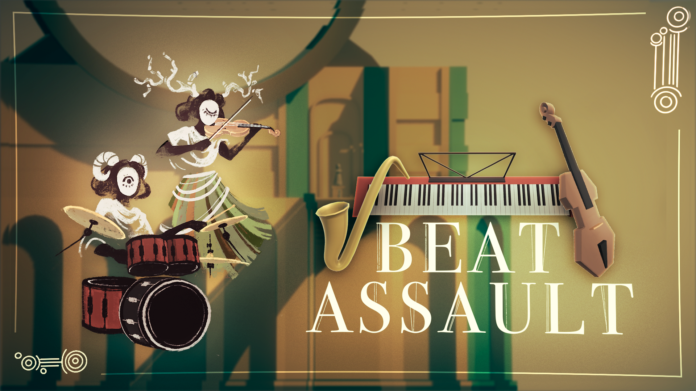
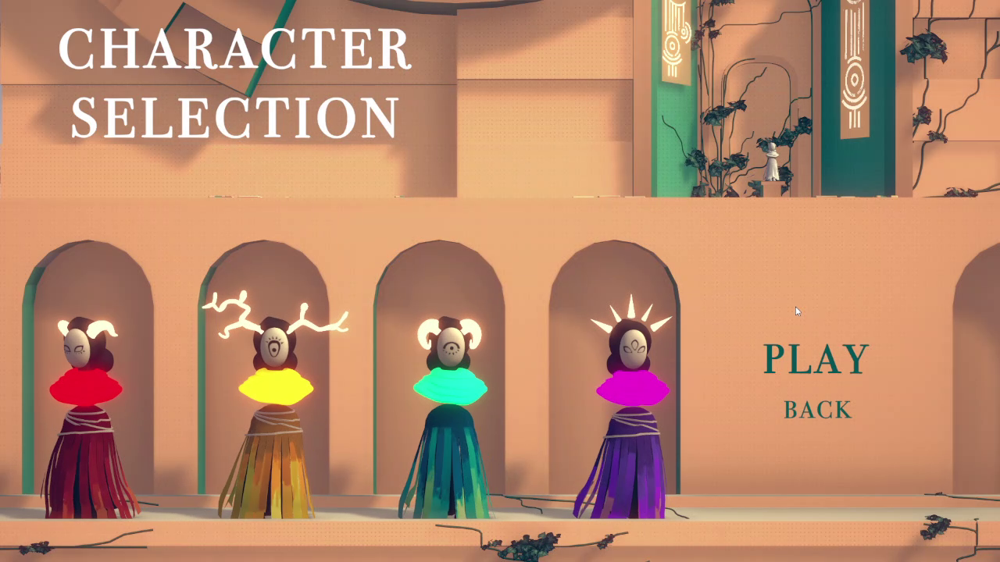
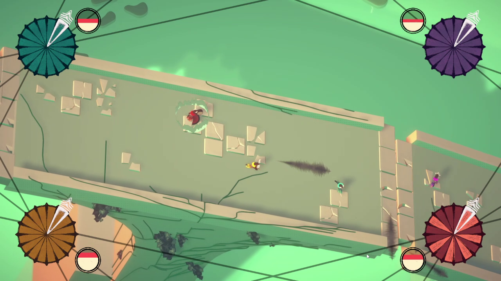

# BeatAssault - 3D Local Multiplayer Rhythm Game
## GamePlay Trailer

  
   
  <em>Click above to watch the gameplay trailer on YouTube</em>

---
## DOWNLOAD ->  [itch.io](https://lina25.itch.io/beat-assault)

## Overview
**Beat Assault** is a 3D multiplayer versus game driven by rhythm mechanics. Developed as a diploma project, it challenges players to collect instruments and time their attacks perfectly to the beat to defeat their opponents.

While many rhythm games are restricted to 2D perspectives, **Beat Assault** brings the genre into a 3D local multiplayer environment, offering a unique cooperative and competitive musical experience.

* **🎮 Gameplay:** 2-4 Players (Local Multiplayer)
* **⏱️ Match Duration:** 10-20 Minutes
* **💻 Platform:** PC / Windows
* **🕹️ Play it on:** [itch.io](https://lina25.itch.io/beat-assault)

## The Team
* **Mariella Pranjic** – Lead Programming (Rhythm Mechanic, Combat Logic, Player Controller, Local Multiplayer,...)
* **Leonard Dirnhofer** – Sound Design
* **Lucas Hinteregger** – 3D Artist
* **Lina Mottl** – 2D Artist
* **Nina Diewald** – Project Management, Game Design, Programming

---

## Key Features
* **Rhythm-Based Combat:** Actions are only effective when performed in sync with the soundtrack's BPM.
* **Local Multiplayer Logic:** Implemented a robust system for handling multiple inputs and character states simultaneously.
* **3D Environment:** A fresh perspective on the rhythm genre, moving away from traditional 2D "lane" mechanics.

---

## Tech
* **Engine:** Unity 2022.3.8f1
* **Language:** C#

---

## Note
> This repository is a re-upload of our diploma project from the year **2024-2025**.
> It serves as a technical showcase of the core systems and the complete game loop developed during that period.

---

## Screenshots

   
  

---

## License
All rights reserved. This repository and its assets are shared for **portfolio and recruitment review only**. You are authorized to clone and run the project for evaluation purposes. Redistribution, commercial use, or modification is strictly prohibited.

